# AI Interview Platform：架构与数据流导师指南

> 阅读目标：先建立系统地图，再理解模块职责，最后沿着真实业务数据流走一遍。
>
> 推荐顺序：系统全景 → 模块边界 → 核心数据模型 → 简历/RAG/面试/语音链路 → 状态机 → 部署。

## 1. 先用一句话理解系统

这是一个以 Spring Boot 为业务中枢的 AI 面试平台：React 负责交互，PostgreSQL 保存业务事实，pgvector 支撑语义检索，Redis 同时承担缓存、限流和异步任务队列，RustFS 保存原始文件，外部模型提供聊天、向量、ASR 和 TTS 能力。

### 系统用例图：用户到底能做什么

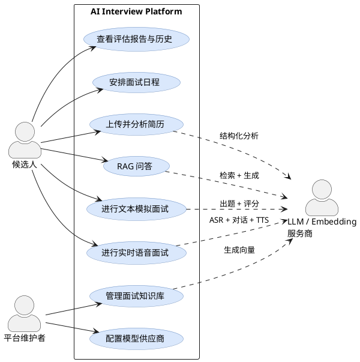

导师视角：用例图先忽略代码。你应该看到两类能力：一类是“资料准备”（简历、知识库、模型配置），另一类是“面试运行”（文本、语音、评估）。前者为后者提供上下文。

## 2. 系统全景：各技术组件如何协作

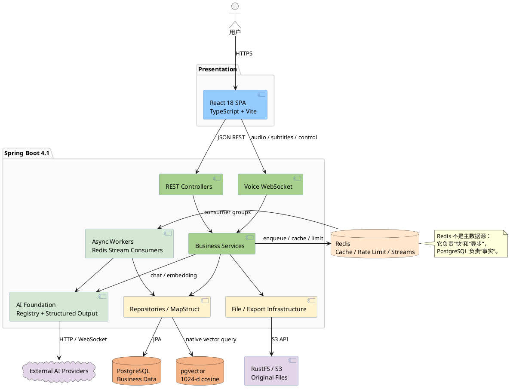

关键边界：

- 前端只通过 `frontend/src/api/` 访问后端，不直接认识数据库或模型供应商。
- Controller 只负责路由、校验和委托；业务编排放在 Service。
- LLM、S3、外部 HTTP 调用不能放进数据库事务，这是系统稳定性的关键规则。
- Redis Stream 把耗时 AI 工作从请求线程移开，让上传接口快速返回 `PENDING`。

## 3. 后端模块地图：代码该去哪里找

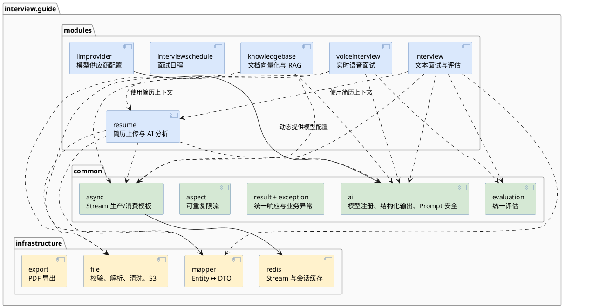

导师视角：`modules/` 按业务垂直切分，`common/` 和 `infrastructure/` 按技术能力横向复用。判断新代码放哪儿时问一句：“这是某个业务独有的规则，还是所有业务都可能使用的技术能力？”

## 4. 核心数据模型：数据库里保存了什么事实

下面是概念模型，刻意省略审计字段和不影响关系理解的属性。

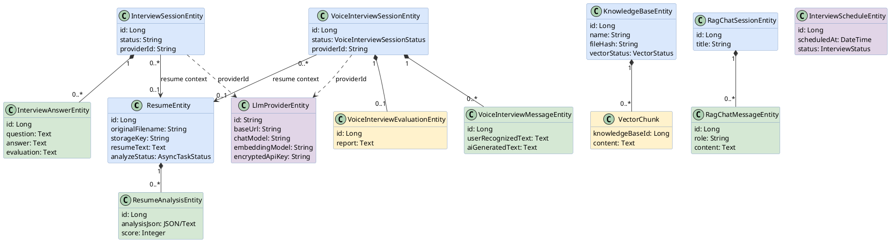

要抓住的设计思想：原始资料、处理状态和 AI 结果分开保存。这样失败可以重试，历史结果可以保留，业务实体也不必被某一次模型调用绑死。

## 5. 简历上传与分析：典型异步任务链路

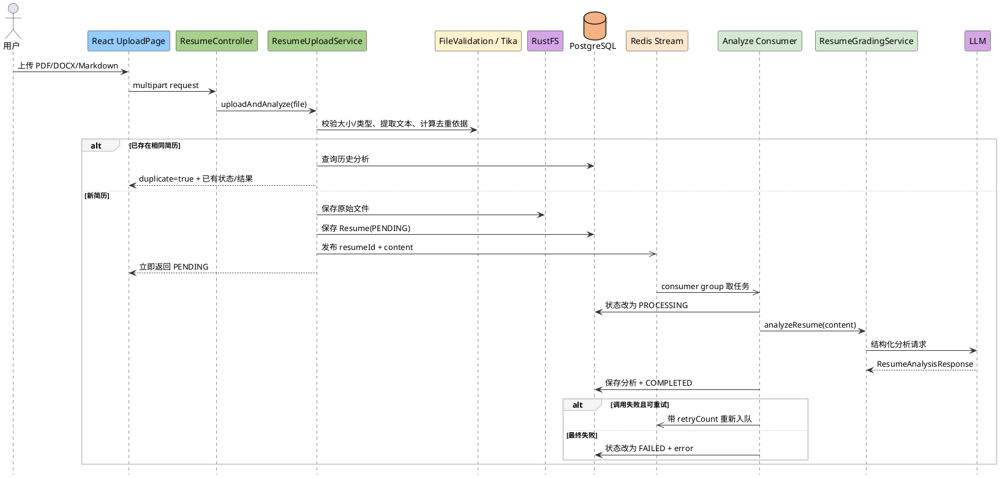

这里最值得学习的是“两阶段响应”：HTTP 请求只负责可靠接收资料，耗时且不稳定的 AI 分析交给异步 Worker。前端通过状态轮询感知完成。

## 6. 知识库与 RAG：写入链路和查询链路

### 6.1 文档写入与向量化

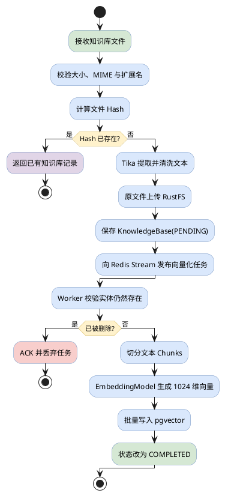

### 6.2 RAG 查询

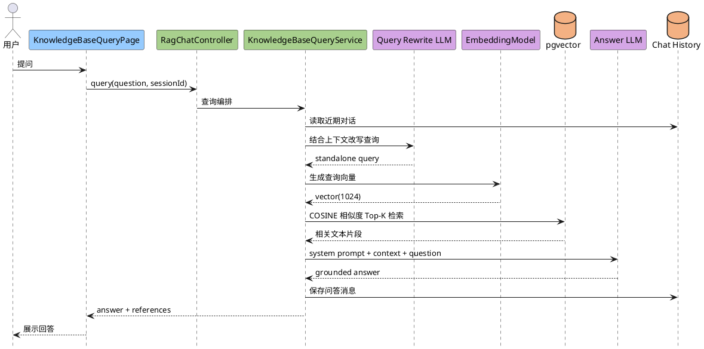

导师视角：RAG 不是“让模型查数据库”，而是应用先检索，再把相关资料拼进 Prompt。检索质量决定“给模型看什么”，生成质量决定“模型如何表达”。

## 7. 文本模拟面试：从建会话到异步评分

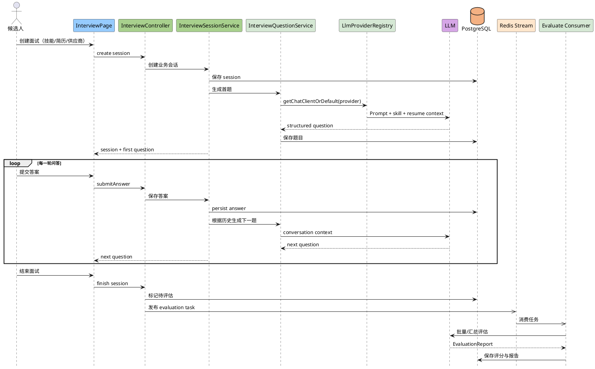

注意 `LlmProviderRegistry` 的价值：业务 Service 不自行拼装 SDK 客户端，而是按 provider ID 获取统一配置的 `ChatClient`。切换模型供应商不会扩散到每个业务模块。

## 8. 实时语音面试：最复杂的数据流

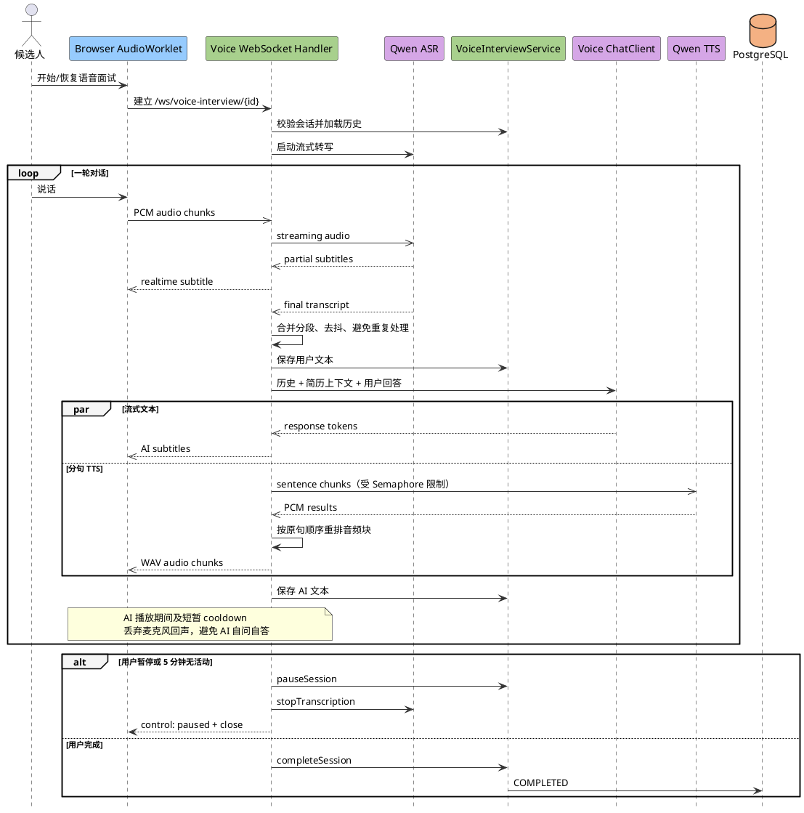

这条链路的难点不是单一 API，而是并发协调：ASR 是持续输入流，LLM 是文本输出流，TTS 可以并行生成但必须按句子顺序播放，同时还要做回声抑制、暂停恢复和断线清理。

## 9. 状态机：异步任务与语音会话如何保持可恢复

### 9.1 通用异步任务状态

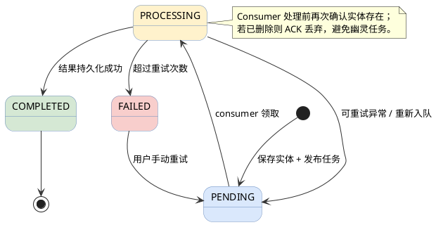

### 9.2 语音面试会话状态

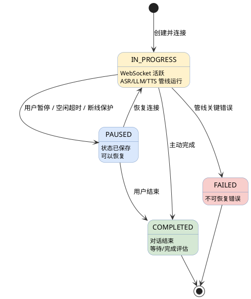

状态字段不是给 UI “显示个标签”而已，它是异步系统恢复、幂等和重试的协议。

## 10. 部署拓扑：本地与生产环境的物理关系

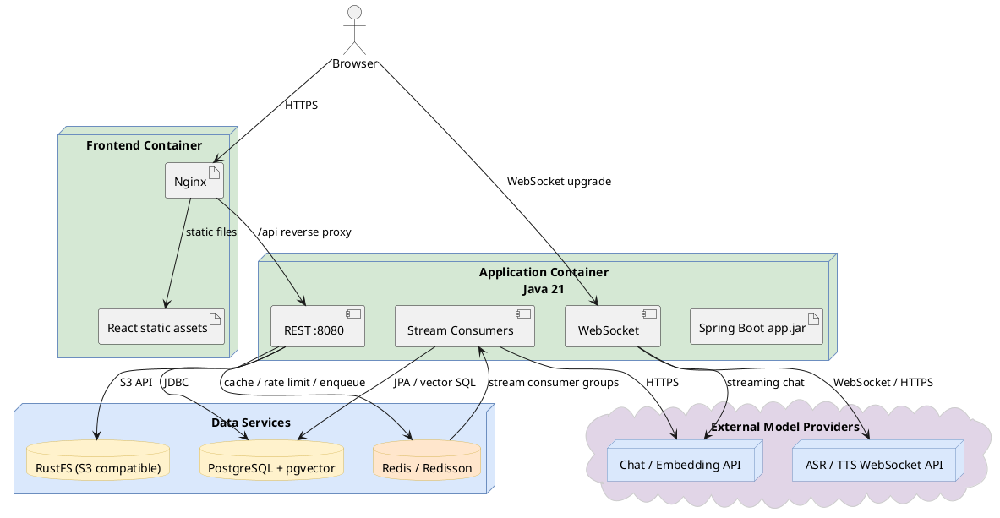

本地开发时这些节点由 `docker-compose.dev.yml` 和本地 `bootRun`/Vite 组合启动；容器化部署时前端 Nginx、后端应用和数据服务分别成为独立节点。

## 11. 像导师一样带你读代码

建议按下面四次“纵向切片”阅读，而不是按目录从头读到尾：

1. **第一次：简历上传**

   从 `ResumeController` 进入，跟到 `ResumeUploadService`、文件基础设施、Repository，再沿 Redis Stream 跟到 `AnalyzeStreamConsumer`。你会一次看懂 Controller → Service → Repository、对象存储和异步模板。

2. **第二次：RAG 查询**

   从 `RagChatController` 跟到 `KnowledgeBaseQueryService`、`VectorRepository`、EmbeddingModel 和 ChatClient。重点看“查询改写 → 向量检索 → Prompt 注入上下文”。

3. **第三次：文本面试**

   从 `InterviewController` 跟到 `InterviewSessionService`、`InterviewQuestionService` 和 `EvaluateStreamConsumer`。重点理解会话聚合、出题策略和统一评估。

4. **第四次：语音面试**

   最后读 `VoiceInterviewWebSocketHandler`。它同时涉及状态、并发、流式 I/O 和资源清理，应该在前三条链路都理解后再读。

### 读代码时持续问的五个问题

- 这段代码处理的是业务规则，还是技术细节？它所在目录合理吗？
- 当前操作的主数据源是谁：PostgreSQL、Redis，还是对象存储？
- 这里是同步边界还是异步边界？调用者如何知道最终结果？
- 这里是否存在事务？事务内有没有不稳定的外部调用？
- 失败后系统靠什么恢复：状态字段、重试次数、幂等检查，还是人工重试？

如果你能沿任意一条链路回答这五个问题，就不只是“看懂代码”，而是开始掌握这个系统的设计。

## 12. 全部实体类图与实际示例

### 12.1 先分清五个实体族

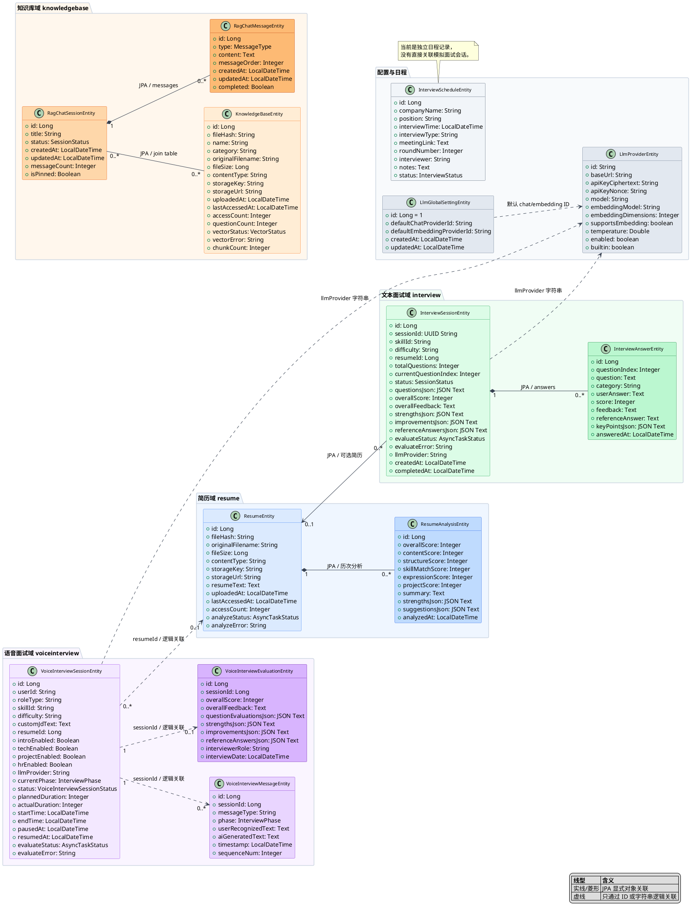

### 12.2 简历域：文件本体与分析结果分开

#### `ResumeEntity`：一次上传的简历文件

实际例子：张三上传了 `张三-Java后端-5年.pdf`。原文件在 RustFS，解析后的纯文本和异步分析状态保存在这条记录中。

```json
{
  "id": 101,
  "fileHash": "9f26...a81c",
  "originalFilename": "张三-Java后端-5年.pdf",
  "fileSize": 428516,
  "contentType": "application/pdf",
  "storageKey": "resumes/2026/07/101.pdf",
  "resumeText": "张三，5年Java开发经验……",
  "accessCount": 3,
  "analyzeStatus": "COMPLETED"
}
```

它回答的是：**“上传了哪份文件，现在处理到哪一步？”** 文件 Hash 用于去重；它本身不是评分报告。

#### `ResumeAnalysisEntity`：某次 AI 简历评分

实际例子：对简历 `101` 的一次分析得到 82 分。以后重新分析，可以再产生一条结果，因此是多对一关系。

```json
{
  "id": 501,
  "resumeId": 101,
  "overallScore": 82,
  "contentScore": 21,
  "structureScore": 17,
  "skillMatchScore": 20,
  "expressionScore": 12,
  "projectScore": 12,
  "summary": "Java基础扎实，有微服务项目经验",
  "strengthsJson": ["Spring生态", "高并发项目"],
  "suggestionsJson": ["补充量化指标", "突出架构决策"]
}
```

它回答的是：**“AI 如何评价这份简历？”** 将结果单独建表，才能保存历史分析。

### 12.3 文本面试域：一场面试包含多条回答

#### `InterviewSessionEntity`：整场文本模拟面试

实际例子：张三基于简历 `101`，进行一场高级 Java 后端面试，共 8 题，目前已经完成并进入异步评估。

```json
{
  "id": 201,
  "sessionId": "c8c6d45a-88fc-4d19-a934-64af91d4df37",
  "skillId": "java-backend",
  "difficulty": "senior",
  "resumeId": 101,
  "totalQuestions": 8,
  "currentQuestionIndex": 8,
  "status": "COMPLETED",
  "overallScore": 84,
  "evaluateStatus": "COMPLETED",
  "llmProvider": "siliconflow"
}
```

它是聚合根，回答：**“这整场面试是什么配置、进行到哪里、最终表现如何？”**

#### `InterviewAnswerEntity`：某一道题及其回答和评分

实际例子：会话 `201` 的第 3 题询问 Redis 缓存穿透，用户回答后得到 86 分。

```json
{
  "id": 20303,
  "sessionId": 201,
  "questionIndex": 3,
  "question": "缓存穿透是什么？如何治理？",
  "category": "Redis",
  "userAnswer": "不存在的Key会持续落到数据库，可以使用布隆过滤器和空值缓存……",
  "score": 86,
  "feedback": "方案正确，可补充空值缓存的过期策略",
  "referenceAnswer": "布隆过滤器、参数校验、缓存空对象……",
  "keyPointsJson": ["定义", "风险", "布隆过滤器", "空值缓存"]
}
```

它回答：**“具体哪道题答了什么、得了多少分？”** `(session_id, question_index)` 有唯一约束，避免同一题重复落库。

### 12.4 知识库域：资料、聊天和消息是三种不同对象

#### `KnowledgeBaseEntity`：一份可供检索的资料

实际例子：维护者上传了《Java并发面试手册》，切成 126 个向量片段。

```json
{
  "id": 301,
  "fileHash": "31bc...e972",
  "name": "Java并发面试手册",
  "category": "Java面试",
  "originalFilename": "java-concurrency-guide.pdf",
  "fileSize": 2384192,
  "contentType": "application/pdf",
  "storageKey": "knowledge/301.pdf",
  "accessCount": 18,
  "questionCount": 42,
  "vectorStatus": "COMPLETED",
  "chunkCount": 126
}
```

它保存文档元数据和向量化状态。真正的 1024 维向量由 `VectorRepository` 管理，不是一个 JPA Entity。

#### `RagChatSessionEntity`：围绕若干知识库的一次对话

实际例子：用户创建“Java并发复习”会话，同时选择知识库 `301` 和“JVM调优手册”。

```json
{
  "id": 401,
  "title": "Java并发复习",
  "status": "ACTIVE",
  "knowledgeBaseIds": [301, 302],
  "messageCount": 6,
  "isPinned": true
}
```

它回答：**“这一串问答属于哪个主题，并允许检索哪些资料？”** 一场 RAG 会话可选多个知识库，一个知识库也可被多场会话使用。

#### `RagChatMessageEntity`：RAG 对话中的一条消息

实际例子：会话 `401` 的第 4 条消息是 AI 根据检索片段生成的回答。

```json
{
  "id": 4004,
  "sessionId": 401,
  "type": "ASSISTANT",
  "content": "volatile 保证可见性和有序性，但不保证复合操作的原子性……",
  "messageOrder": 4,
  "completed": true
}
```

流式回答期间 `completed=false`，输出结束后变成 `true`。因此消息记录可以表示“正在生成”。

### 12.5 语音面试域：会话、对话片段、最终报告

#### `VoiceInterviewSessionEntity`：一场实时语音面试

实际例子：张三进行 30 分钟高级 Java 后端语音面试，技术和项目阶段开启，HR 阶段关闭。

```json
{
  "id": 601,
  "userId": "user-zhangsan",
  "roleType": "JAVA_BACKEND",
  "skillId": "java-backend",
  "difficulty": "senior",
  "resumeId": 101,
  "introEnabled": true,
  "techEnabled": true,
  "projectEnabled": true,
  "hrEnabled": false,
  "llmProvider": "siliconflow",
  "currentPhase": "PROJECT",
  "status": "IN_PROGRESS",
  "plannedDuration": 30,
  "actualDuration": 18
}
```

它回答：**“实时面试当前处于哪个阶段和生命周期状态？”** `resumeId` 只是 Long 字段，不是 JPA 的 `ResumeEntity` 对象关联。

#### `VoiceInterviewMessageEntity`：一次候选人回答与 AI 追问记录

实际例子：技术阶段第 5 轮，ASR 识别出用户回答，随后 AI 生成追问。

```json
{
  "id": 6105,
  "sessionId": 601,
  "messageType": "USER_SPEECH",
  "phase": "TECH",
  "userRecognizedText": "线程池的核心参数包括核心线程数、最大线程数……",
  "aiGeneratedText": "如果任务队列已满，接下来会发生什么？",
  "sequenceNum": 5,
  "timestamp": "2026-07-10T14:32:18"
}
```

这里一条记录可能同时承载用户识别文本和 AI 后续文本。它通过 `sessionId` 逻辑关联会话，没有 JPA 级联关系。

#### `VoiceInterviewEvaluationEntity`：整场语音面试的最终报告

实际例子：会话 `601` 结束后异步生成唯一一份评估结果。

```json
{
  "id": 6201,
  "sessionId": 601,
  "overallScore": 81,
  "overallFeedback": "技术基础扎实，回答结构清晰，但容量评估不够量化",
  "questionEvaluationsJson": [{"sequence": 1, "score": 84}],
  "strengthsJson": ["Java并发", "故障排查"],
  "improvementsJson": ["量化性能指标", "补充取舍分析"],
  "referenceAnswersJson": ["线程池拒绝策略包括……"],
  "interviewerRole": "JAVA_BACKEND",
  "interviewDate": "2026-07-10T14:00:00"
}
```

`session_id` 有唯一约束，所以一场语音会话只有一份当前评估报告。

### 12.6 模型配置域：供应商清单和全局默认值分开

#### `LlmProviderEntity`：一个可调用的模型供应商配置

实际例子：配置一个兼容 OpenAI API 的 SiliconFlow 供应商，同时提供聊天和 1024 维 Embedding。

```json
{
  "id": "siliconflow",
  "baseUrl": "https://api.siliconflow.example/v1",
  "apiKeyCiphertext": "<AES-GCM密文>",
  "apiKeyNonce": "<随机Nonce>",
  "model": "Qwen3-32B",
  "embeddingModel": "BAAI/bge-m3",
  "embeddingDimensions": 1024,
  "supportsEmbedding": true,
  "temperature": 0.7,
  "enabled": true,
  "builtin": true
}
```

API Key 不以明文保存。它回答：**“怎么连接某个模型服务，它支持什么能力？”**

#### `LlmGlobalSettingEntity`：全系统默认选哪个供应商

实际例子：普通聊天默认用 `siliconflow`，向量生成默认用 `dashscope`。

```json
{
  "id": 1,
  "defaultChatProviderId": "siliconflow",
  "defaultEmbeddingProviderId": "dashscope"
}
```

这是固定 `id=1` 的单例配置。它不复制供应商参数，只保存两个 Provider ID。

### 12.7 日程域：现实中的一次面试安排

#### `InterviewScheduleEntity`：日历上的一个面试事件

实际例子：张三下周参加某公司的二轮视频面试。

```json
{
  "id": 701,
  "companyName": "示例科技",
  "position": "高级Java开发工程师",
  "interviewTime": "2026-07-15T14:00:00",
  "interviewType": "VIDEO",
  "meetingLink": "https://meeting.example/abc",
  "roundNumber": 2,
  "interviewer": "李经理",
  "notes": "重点准备系统设计和项目复盘",
  "status": "PENDING"
}
```

它是一个独立日历事项，目前没有外键连接文本面试或语音面试。不要把“现实招聘面试安排”和“平台里的模拟面试会话”混为一类。

### 12.8 最容易混淆的名字

| 类 | 它代表什么 | 不代表什么 |
|---|---|---|
| `ResumeEntity` | 上传文件及处理状态 | AI 评分结果 |
| `ResumeAnalysisEntity` | 某次简历评分 | 原始简历文件 |
| `InterviewSessionEntity` | 一整场文本模拟面试 | 单道题的回答 |
| `InterviewAnswerEntity` | 一道题、回答和评分 | 整场面试报告 |
| `KnowledgeBaseEntity` | 一份可向量化资料 | 一次 RAG 对话 |
| `RagChatSessionEntity` | 一组连续 RAG 问答 | 某一条消息 |
| `RagChatMessageEntity` | 用户或 AI 的一条消息 | 知识库文档 |
| `VoiceInterviewSessionEntity` | 语音会话生命周期 | 音频文件本身 |
| `VoiceInterviewMessageEntity` | 一轮识别文本/AI 文本 | 最终综合报告 |
| `VoiceInterviewEvaluationEntity` | 整场语音面试报告 | 每个音频分片 |
| `LlmProviderEntity` | 某家模型服务的连接配置 | 当前默认选择 |
| `LlmGlobalSettingEntity` | 默认 chat/embedding Provider ID | API Key 与模型详情 |
| `InterviewScheduleEntity` | 现实面试日程 | 平台模拟面试会话 |
