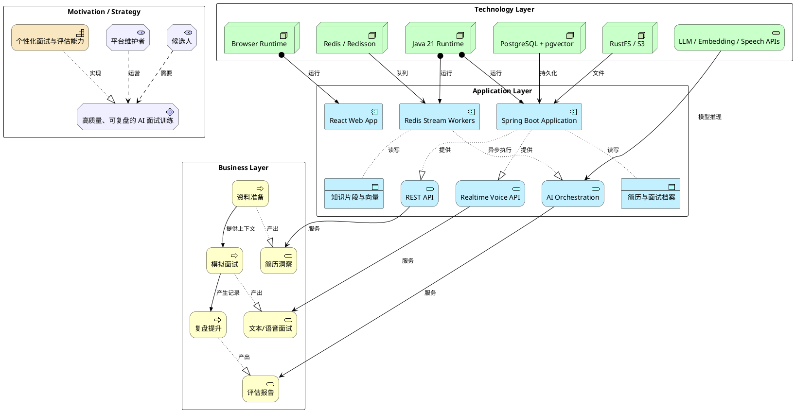
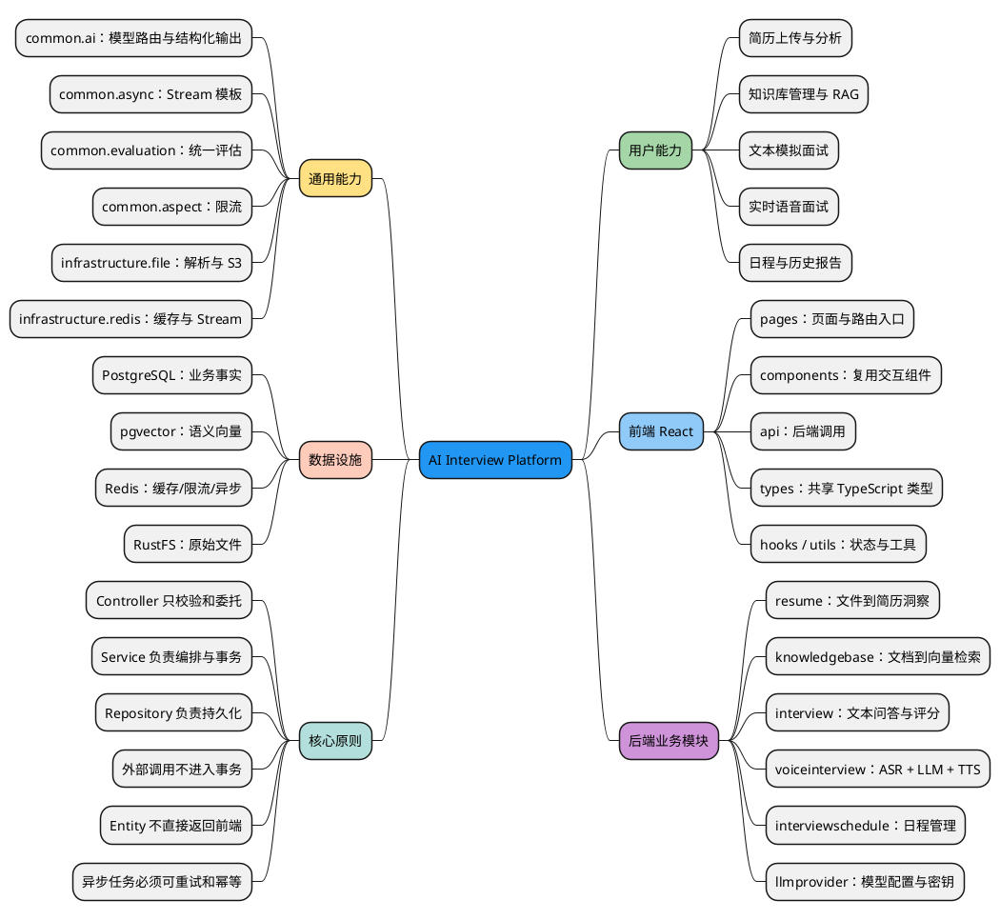

# AI Interview Platform 多视角可视化指南

这份文档调用多种已安装的绘图 skills，从不同抽象层次解释同一个系统。详细的 UML 类图、时序图、状态图和部署图参见 [ARCHITECTURE.md](./ARCHITECTURE.md)。

## 1. Architecture：一眼看清技术分层

这张图适合第一次接触项目时阅读。纵向是请求从界面走向基础设施的路径，两侧是贯穿所有层的工程能力。

<div style="width: 1200px; box-sizing: border-box; position: relative; background: #fafbfc; padding: 20px; border-radius: 6px; border: 1px solid #e5e7eb;"><style scoped>.arch-wrapper { display: flex; gap: 12px; }.arch-sidebar { width: 165px; flex-shrink: 0; }.arch-main { flex: 1; min-width: 0; }.arch-title { text-align: center; font-size: 22px; font-weight: bold; color: #1f2937; margin-bottom: 16px; }.arch-layer { margin: 8px 0; padding: 14px; border-radius: 6px; box-shadow: 0 1px 3px rgba(0,0,0,.04); }.arch-layer-title { font-size: 13px; font-weight: bold; margin-bottom: 10px; text-align: center; }.arch-grid { display: grid; gap: 8px; }.arch-grid-2 { grid-template-columns: repeat(2,1fr); }.arch-grid-3 { grid-template-columns: repeat(3,1fr); }.arch-grid-4 { grid-template-columns: repeat(4,1fr); }.arch-grid-5 { grid-template-columns: repeat(5,1fr); }.arch-box { border-radius: 4px; padding: 8px; text-align: center; font-size: 11px; font-weight: 600; line-height: 1.35; color: #1f2937; background: #fff; border: 1px solid #e5e7eb; }.arch-box.highlight { background: #f3f4f6; border: 2px solid #6b7280; }.arch-box.tech { font-size: 10px; color: #6b7280; background: #f9fafb; }.arch-layer.user { background: linear-gradient(135deg,#eff6ff,#dbeafe); border: 2px solid #3b82f6; }.arch-layer.user .arch-layer-title { color: #1d4ed8; }.arch-layer.application { background: linear-gradient(135deg,#fffbeb,#fef3c7); border: 2px solid #d97706; }.arch-layer.application .arch-layer-title { color: #92400e; }.arch-layer.ai { background: linear-gradient(135deg,#f0fdf4,#dcfce7); border: 2px solid #16a34a; }.arch-layer.ai .arch-layer-title { color: #15803d; }.arch-layer.data { background: linear-gradient(135deg,#fdf2f8,#fce7f3); border: 2px solid #db2777; }.arch-layer.data .arch-layer-title { color: #9d174d; }.arch-layer.infra { background: linear-gradient(135deg,#f3f4f6,#e5e7eb); border: 2px solid #6b7280; }.arch-layer.infra .arch-layer-title { color: #374151; }.arch-layer.external { background: linear-gradient(135deg,#f9fafb,#f3f4f6); border: 1px dashed #d1d5db; }.arch-sidebar-panel { border-radius: 6px; padding: 10px; background: linear-gradient(135deg,#f3f4f6,#e5e7eb); border: 1px solid #d1d5db; margin-bottom: 8px; }.arch-sidebar-title { font-size: 12px; font-weight: bold; text-align: center; color: #1f2937; margin-bottom: 6px; }.arch-sidebar-item { font-size: 10px; text-align: center; color: #374151; background: #fff; padding: 5px; border-radius: 3px; margin: 3px 0; border: 1px solid #e5e7eb; }</style><div class="arch-title">AI Interview Platform · Layered Architecture</div><div class="arch-wrapper"><div class="arch-sidebar"><div class="arch-sidebar-panel"><div class="arch-sidebar-title">可靠性</div><div class="arch-sidebar-item">统一业务异常</div><div class="arch-sidebar-item">任务状态机</div><div class="arch-sidebar-item">幂等与重试</div><div class="arch-sidebar-item">健康检查</div></div><div class="arch-sidebar-panel"><div class="arch-sidebar-title">可观测性</div><div class="arch-sidebar-item">SLF4J 日志</div><div class="arch-sidebar-item">Micrometer 指标</div><div class="arch-sidebar-item">任务耗时</div></div></div><div class="arch-main"><div class="arch-layer user"><div class="arch-layer-title">用户与交互层</div><div class="arch-grid arch-grid-4"><div class="arch-box">简历中心<br><small>上传 / 分析</small></div><div class="arch-box">文本面试<br><small>问答 / 报告</small></div><div class="arch-box">语音面试<br><small>实时字幕 / 音频</small></div><div class="arch-box">知识库<br><small>管理 / RAG</small></div></div></div><div class="arch-layer application"><div class="arch-layer-title">应用与业务层 · Spring Boot</div><div class="arch-grid arch-grid-5"><div class="arch-box">Resume</div><div class="arch-box">Interview</div><div class="arch-box highlight">Voice Interview</div><div class="arch-box">Knowledge Base</div><div class="arch-box">Schedule</div></div></div><div class="arch-layer ai"><div class="arch-layer-title">AI 编排层</div><div class="arch-grid arch-grid-4"><div class="arch-box">Provider Registry<br><small>动态模型路由</small></div><div class="arch-box">Structured Output<br><small>校验与重试</small></div><div class="arch-box">Skills / Prompts<br><small>领域上下文</small></div><div class="arch-box">Unified Evaluation<br><small>批量评分</small></div></div></div><div class="arch-layer data"><div class="arch-layer-title">数据与异步层</div><div class="arch-grid arch-grid-4"><div class="arch-box tech">PostgreSQL<br><small>业务事实</small></div><div class="arch-box tech">pgvector<br><small>1024-d COSINE</small></div><div class="arch-box tech">Redis<br><small>Cache / Stream / Limit</small></div><div class="arch-box tech">RustFS<br><small>S3 文件存储</small></div></div></div><div class="arch-layer infra"><div class="arch-layer-title">运行基础设施</div><div class="arch-grid arch-grid-3"><div class="arch-box tech">Java 21<br><small>Spring Boot 4.1</small></div><div class="arch-box tech">React 18<br><small>Vite + Tailwind</small></div><div class="arch-box tech">Docker Compose<br><small>本地与部署</small></div></div></div><div class="arch-layer external"><div class="arch-layer-title">外部模型服务</div><div class="arch-grid arch-grid-3"><div class="arch-box tech">Chat LLM</div><div class="arch-box tech">Embedding Model</div><div class="arch-box tech">ASR / TTS</div></div></div></div><div class="arch-sidebar"><div class="arch-sidebar-panel"><div class="arch-sidebar-title">横切能力</div><div class="arch-sidebar-item">RateLimit Aspect</div><div class="arch-sidebar-item">Prompt Sanitizer</div><div class="arch-sidebar-item">API Key 加密</div><div class="arch-sidebar-item">MapStruct</div></div><div class="arch-sidebar-panel"><div class="arch-sidebar-title">架构约束</div><div class="arch-sidebar-item">Controller → Service → Repo</div><div class="arch-sidebar-item">外部调用不进事务</div><div class="arch-sidebar-item">Entity 不直接返回</div></div></div></div></div>

读图诀窍：中间五层回答“系统由什么组成”，左侧回答“怎么保证运行可靠”，右侧回答“所有业务都必须遵守什么规则”。

## 2. ArchiMate：业务价值如何落到应用和技术

UML 更关心软件结构；ArchiMate 更关心“为什么建、由谁用、靠什么实现”。



核心理解：技术选择不是孤立的。Redis Stream 是为了让“面试体验”不被耗时 AI 调用阻塞；pgvector 是为了让“资料准备”能转化为面试时可检索的上下文。

## 3. Data Analytics：系统里的数据从哪里来、到哪里去

这里把项目视为一条 AI 数据管线。实线表示同步或批处理，虚线表示流式或异步处理。

```plantuml
@startuml
left to right direction
skinparam package {
  BackgroundColor #FAFAFA
  BorderColor #cccccc
}

package "Sources" {
  file "简历文件" as resume
  file "知识库文档" as docs
  component "文本答案" as textAnswer
  component "麦克风 PCM" as pcm
}

package "Ingestion" {
  component "REST Upload" as upload
  component "WebSocket" as ws
  component "Tika Parser" as tika
  component "ASR" as asr
}

package "Async Transform" {
  database "Redis Streams" as streams
  component "Resume Analyze" as analyze
  component "Chunk + Embed" as embed
  component "Interview Evaluate" as evaluate
}

package "Storage" {
  mxgraph.aws4.s3 "RustFS\nOriginal Files" as s3
  mxgraph.aws4.rds_postgresql_instance "PostgreSQL\nBusiness Records" as pg
  database "pgvector\n1024-d Embeddings" as vector
  mxgraph.aws4.elasticache_for_redis "Redis\nCache + State" as cache
}

package "Serving" {
  component "RAG Retrieval" as rag
  component "Question Generator" as question
  component "Unified Evaluation" as report
  component "History / Reports UI" as ui
}

resume --> upload
docs --> upload
upload --> tika
upload --> s3 : raw files
upload --> pg : metadata + text
tika ..> streams : async tasks
streams ..> analyze
streams ..> embed
streams ..> evaluate
analyze --> pg : structured analysis
embed --> vector : chunk vectors
textAnswer --> pg
pcm ..> ws
ws ..> asr
asr --> pg : transcript
pg --> question : resume + history
vector --> rag : cosine top-k
rag --> question : context
pg --> evaluate : Q&A records
evaluate --> pg : scores + report
pg --> ui
cache -- ws : live session state
@enduml
```

你可以把四类存储记成一句口诀：**文件进 RustFS，事实进 PostgreSQL，语义进 pgvector，速度和异步进 Redis。**

## 4. Mind Map：项目知识地图

当你不知道某个功能该从哪里找时，用这张图定位。



## 5. Infographic：四条核心业务链路速览

```infographic
infographic list-grid-badge-card
data
  title 四条核心业务链路
  desc 从输入到 AI 结果的最短心智模型
  items
    - label 简历分析
      desc 文件 → Tika → RustFS/PostgreSQL → Redis Stream → LLM 结构化评分
      icon mdi/file-account
    - label 知识库 RAG
      desc 文档 → 分块 → Embedding → pgvector → Top-K 检索 → LLM 回答
      icon mdi/database-search
    - label 文本面试
      desc 简历/技能上下文 → 动态出题 → 保存回答 → 异步批量评估
      icon mdi/message-text
    - label 语音面试
      desc PCM → ASR → 对话 LLM → 分句 TTS → 有序音频回传
      icon mdi/microphone-message
theme
  palette #3b82f6 #8b5cf6 #16a34a #f97316
```

## 6. Infographic：推荐学习路线

```infographic
infographic sequence-roadmap-vertical-simple
data
  title 项目源码学习路线
  desc 每一步都沿一条完整业务链纵向阅读
  items
    - label 建立系统地图
      time 第 1 步
      desc 阅读本页分层图、知识地图与 ARCHITECTURE.md
    - label 跟踪简历上传
      time 第 2 步
      desc 掌握 MVC、文件存储、事务和 Redis Stream
    - label 跟踪 RAG 查询
      time 第 3 步
      desc 掌握 Embedding、向量检索和 Prompt 上下文
    - label 跟踪文本面试
      time 第 4 步
      desc 掌握会话聚合、动态出题和统一评估
    - label 攻克语音面试
      time 第 5 步
      desc 掌握 WebSocket、流式处理、并发排序和资源清理
theme
  palette #2563eb #0891b2 #16a34a #d97706 #7c3aed
```

## 7. 用这些图进行自测

合上源码后，尝试回答：

1. 为什么 Redis 不能被当成最终业务事实的来源？
2. 简历上传接口为什么返回 `PENDING` 而不是等待分析完成？
3. RAG 的向量检索发生在 LLM 调用之前还是之后？
4. 语音链路为什么需要并行做 TTS，却又要按原顺序播放？
5. 新增一个 AI 供应商时，为什么主要修改 `llmprovider` 和 `LlmProviderRegistry`，而不是每个业务 Service？

如果能脱离图回答这五题，你已经建立了这套系统的核心架构心智模型。
